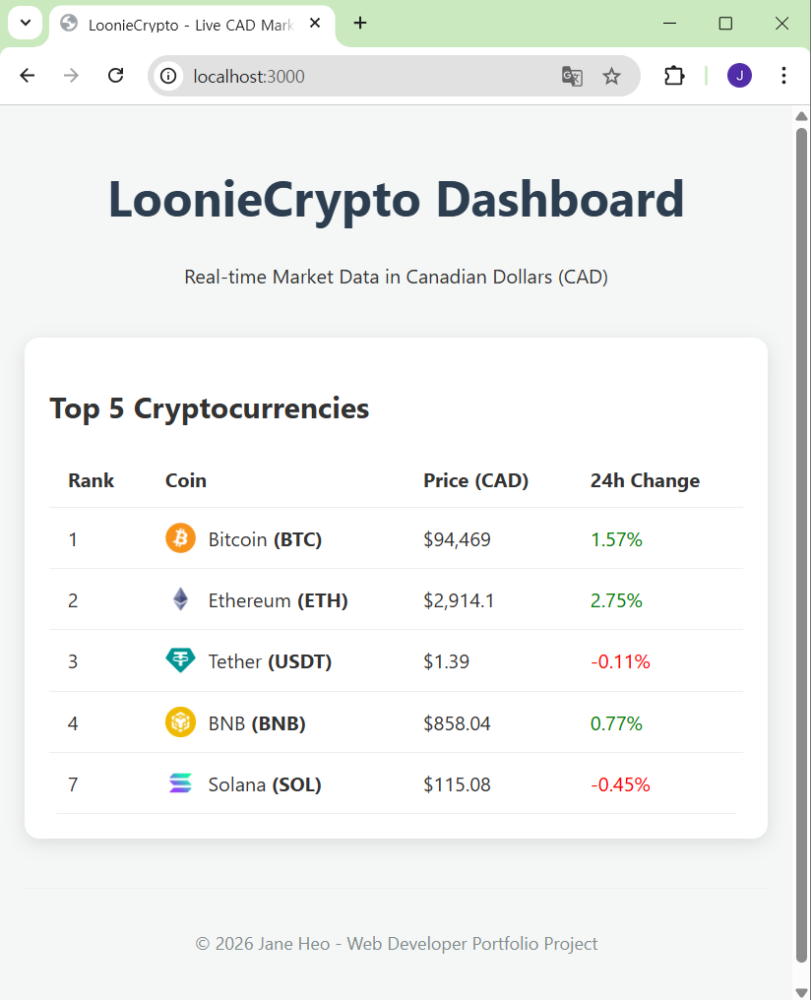
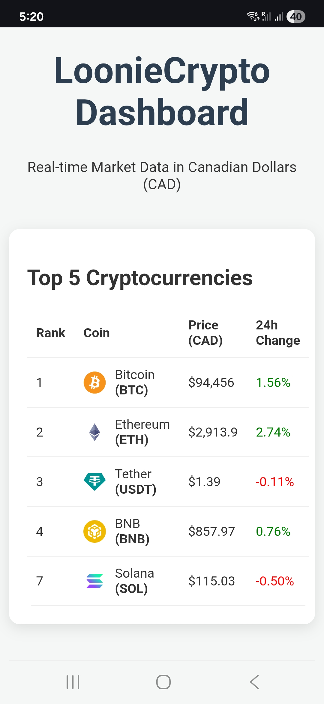

# 🚀 LoonieCrypto Dashboard

A real-time cryptocurrency market data dashboard specifically tailored for the Canadian market, displaying prices in **CAD**.

## 📸 Preview
| Desktop Version | Mobile Version |
| :---: | :---: |
|  |  |

## ✨ Key Features
- **Real-time Data:** Fetches top 5 cryptocurrencies using the CoinGecko API.
- **Auto-Refresh:** Automatically updates market data every 60 seconds without manual reload.
- **Responsive UI:** Fully responsive design built with EJS and custom CSS (Mobile-friendly).
- **Interactive UX:** Smooth hover effects on data rows for better readability.

## 🛠 Tech Stack
- **Backend:** Node.js, Express
- **Frontend:** EJS (Embedded JavaScript templates), CSS3
- **API:** CoinGecko API(https://api.coingecko.com/api/v3/coins/markets)


## 🚀 How to Run Locally
1. Clone the repository:
   ```bash
   git clone https://github.com/heoinhye/loonie-crypto.git
   ```
2. Install dependencies:
    ```bash
    npm install
    ```
3. Start the server:
    ```bash
    node index.js
    ```